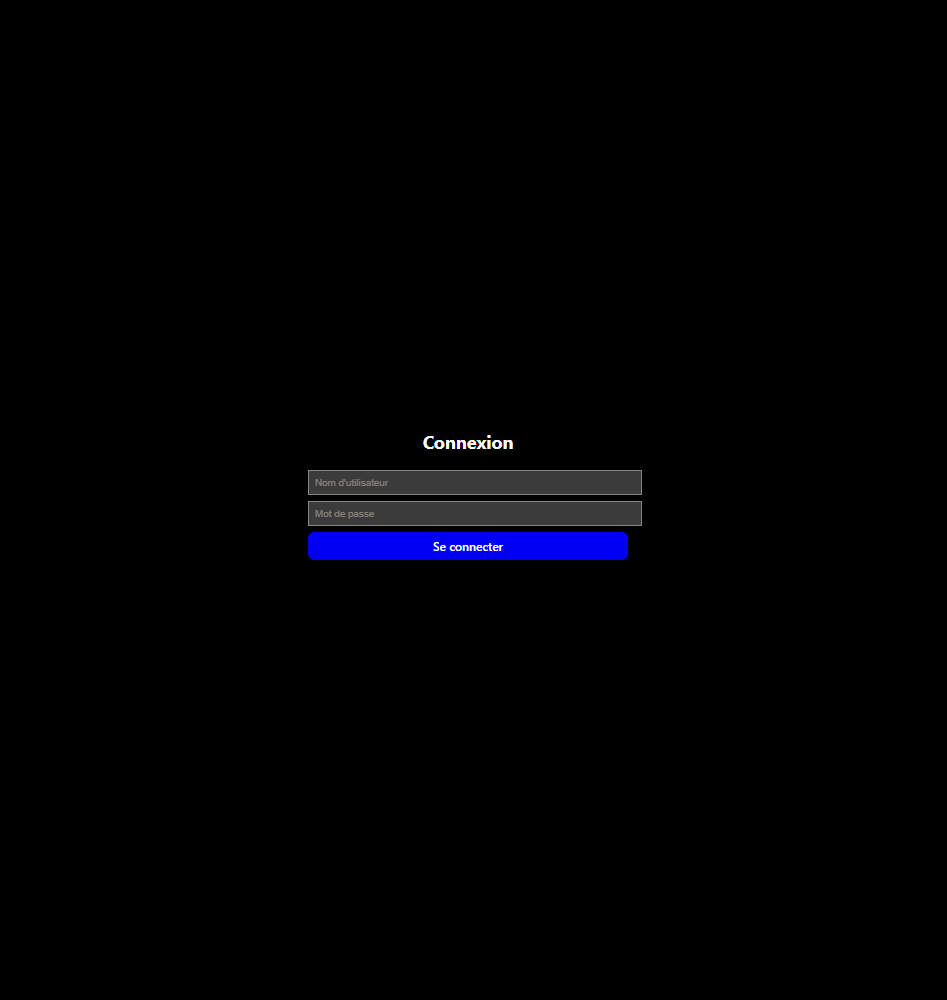
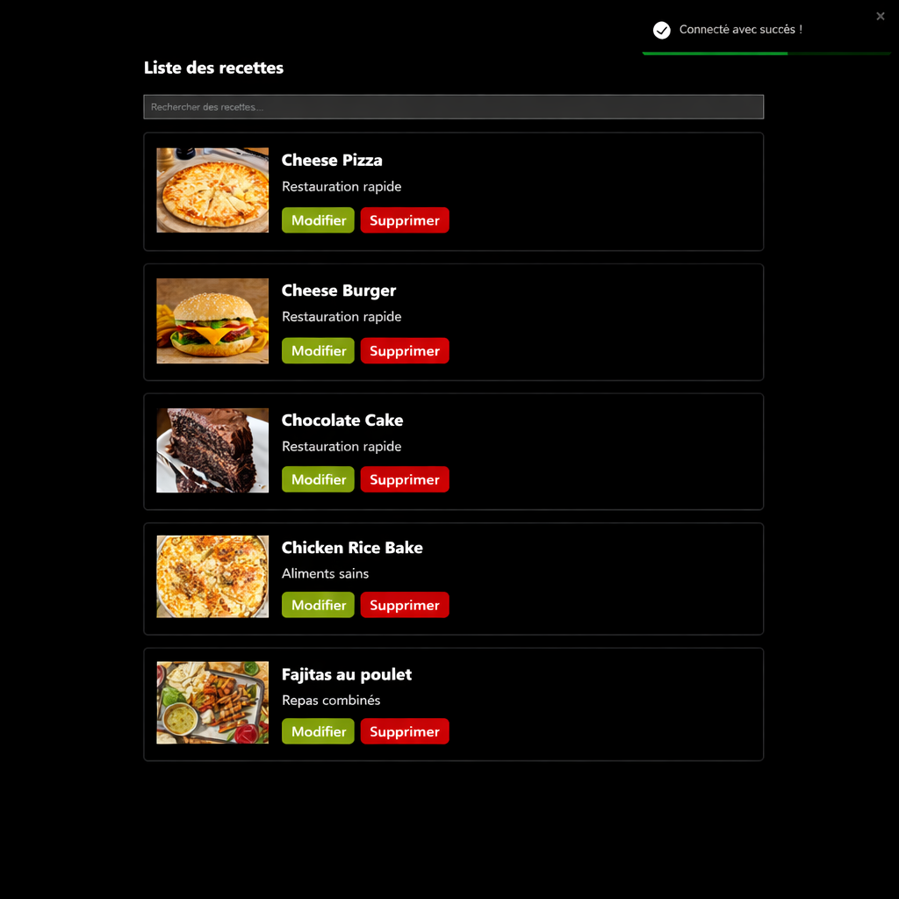
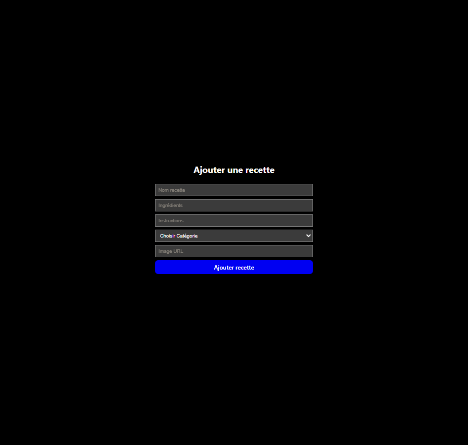
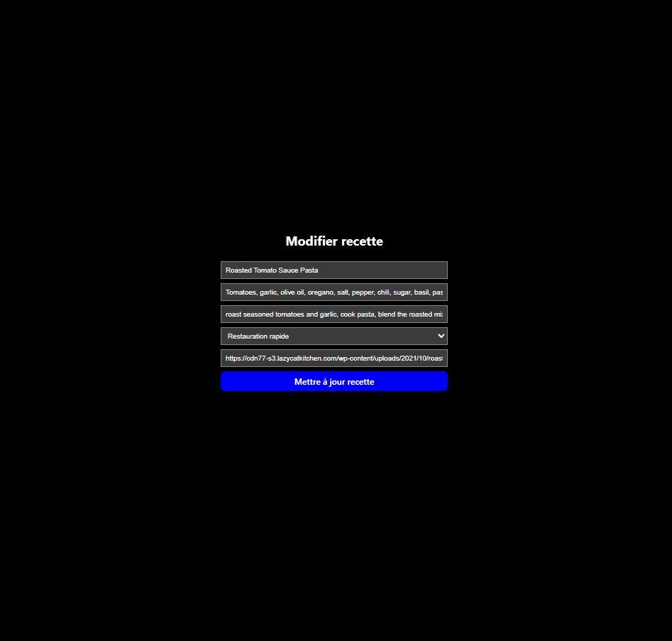

# Recipe App Frontend 🍳

## Overview

This is the frontend of a full-stack recipe management app I built. It lets users sign up, log in, and manage their own recipes through a simple interface.

The app is built with React and connects to a backend API for authentication and data handling.

---

## Live App

https://recipe-project-frontend-vbr6.onrender.com/login

---

## What you can do

* Create an account and log in
* View all recipes
* Add new recipes
* Edit existing ones
* Delete recipes
* See recipe details

Most of the app is protected, so you need to be logged in to use it.

---

## Tech stack

* React
* React Router
* Axios
* Context API (for auth)
* Styled Components
* Vite
* Render (deployment)

---

## Routing

Public pages:

* `/login`
* `/signup`

Private pages:

* `/recipes`
* `/add`
* `/edit/:id`
* `/recipe/:id`

Private routes are handled with a custom `PrivateRoute` component.

---

## Authentication

* When a user logs in, a JWT token is saved in `localStorage`
* That token is automatically attached to API requests using an Axios interceptor
* If the user is not authenticated, they get redirected to `/login`

---

## API connection

The frontend uses a centralized Axios instance (`api.js`).

It reads the backend URL from an environment variable:

```env
VITE_API_URL=https://recipe-project-backend-mny2.onrender.com
```

---

## Running locally

```bash
cd frontend
npm install
npm run dev
```

---

## Notes

* The app redirects unauthenticated users to the login page
* Most actions (like recipes) require a valid token
* The UI is styled using styled-components instead of plain CSS

---

## About this project

I originally built this project a few months ago and came back to it to clean things up, fix deployment issues, and better understand how everything connects (frontend ↔ backend ↔ database).

It’s part of my portfolio to show a full-stack app with authentication, protected routes, and real deployment.

## Screenshots

### Login


### Recipes


### Add Recipe


### Edit Recipe

