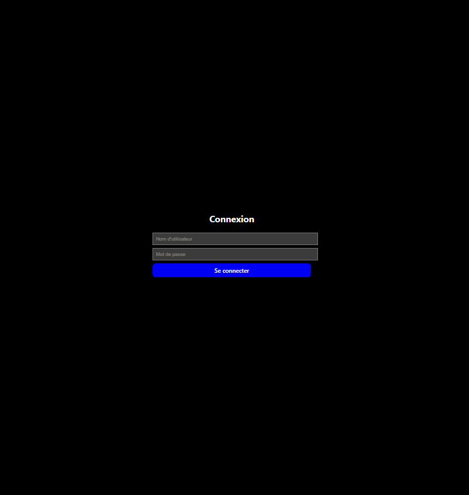
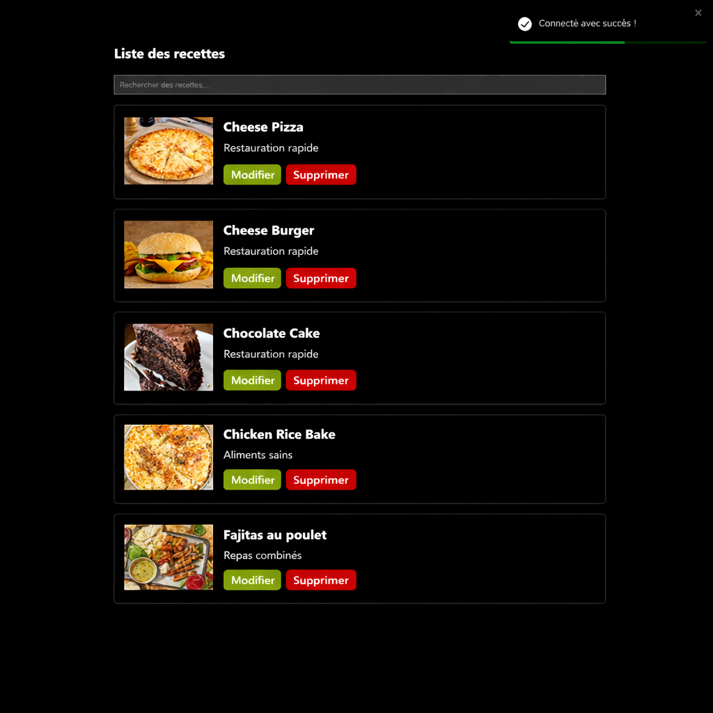
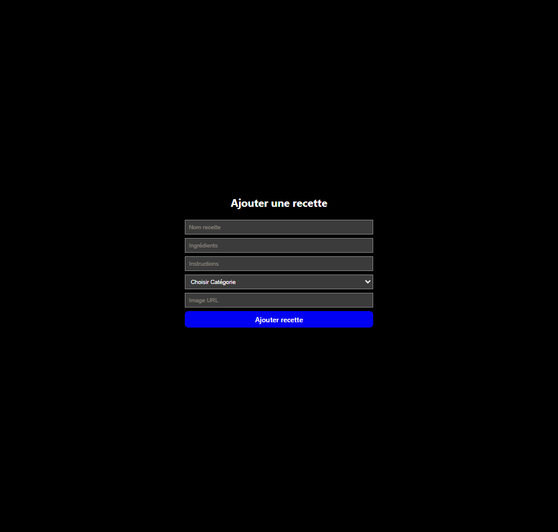
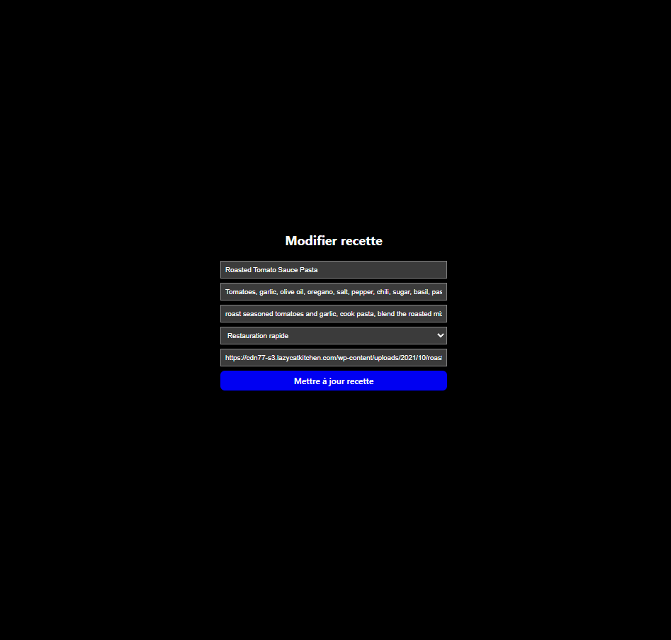

# Recipe Management Frontend 🍳

## Overview

This is the frontend for a full-stack recipe management application I built as part of my web development program. It allows users to register, log in, and manage their own recipes through a simple and responsive interface.

The application is built with React and communicates with a REST API for authentication and recipe management.

---

## Live Application

https://recipe-project-frontend-vbr6.onrender.com/login

---

## Backend Repository

https://github.com/jeffsawma/recipe-project-backend

---

## Features

- User registration and login
- JWT-based authentication
- Protected routes
- Search recipes
- Add new recipes
- View recipe details
- Edit recipes created by the logged-in user
- Delete recipes created by the logged-in user
- Logout functionality
- Automatic redirection to the login page when not authenticated

---

## Tech Stack

- React
- React Router
- Axios
- Context API
- Styled Components
- Vite
- Render

---

## Application Routes

### Public Routes

| Route | Description |
|-------|-------------|
| `/login` | User login |
| `/signup` | User registration |

### Protected Routes

| Route | Description |
|-------|-------------|
| `/recipes` | View all recipes |
| `/add` | Add a new recipe |
| `/edit/:id` | Edit one of your recipes |
| `/recipe/:id` | View recipe details |

Protected pages are handled through a custom `PrivateRoute` component.

---

## Authentication

- A JWT token is stored in `localStorage` after a successful login.
- Axios automatically includes the token in every protected request.
- Users who are not authenticated are redirected to the login page.
- Users can only edit or delete recipes they own.

---

## Demo Account

You can use the following account to test the deployed application:

```text
Username: Tester
Password: 0000
```

---

## Backend API

The frontend communicates with the backend using a centralized Axios instance (`api.js`).

The backend URL is loaded through an environment variable:

```env
VITE_API_URL=https://recipe-project-backend-mny2.onrender.com
```

---

## Running Locally

```bash
cd frontend
npm install
npm run dev
```

---

## Notes

- Authentication state is managed using React Context.
- Protected routes prevent unauthorized access.
- Styled Components are used for the user interface.
- The application communicates with a Node.js / Express backend connected to a MySQL database.

---

## About this Project

I originally built this project during my web development program. A few months later, I revisited it to improve the codebase, fix deployment issues, refine the authentication flow, improve the user experience, and prepare it as a portfolio project.

---

## Screenshots

### Login



### Recipe List



### Add Recipe



### Edit Recipe


